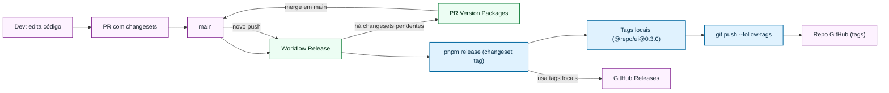
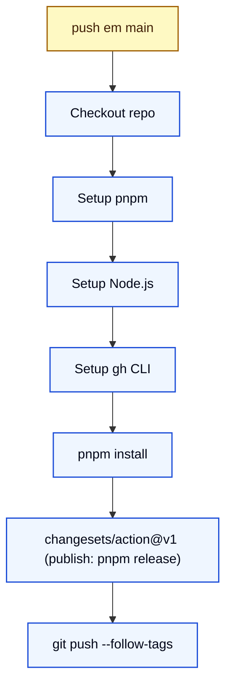
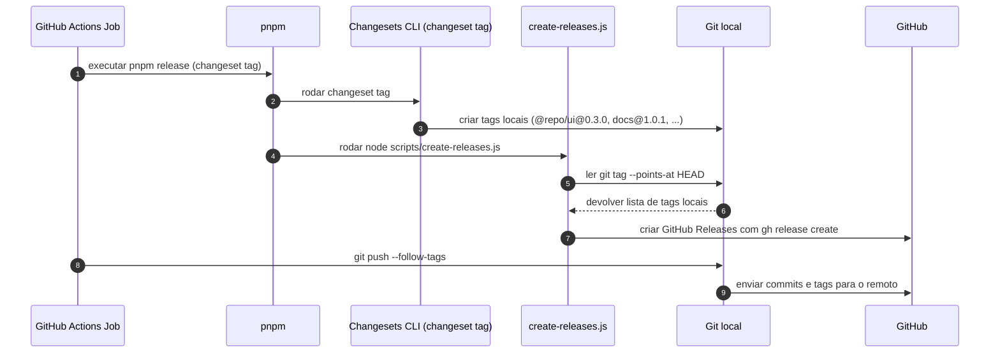
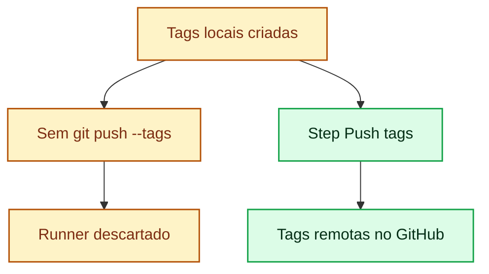

# Fluxo de Releases com Changesets, CI e GitHub Releases

Este documento descreve o fluxo completo de versionamento, publicação e criação de releases, usando:

- Changesets
- GitHub Actions
- pnpm
- Git tags + GitHub Releases
- Script `scripts/create-releases.js`

Os diagramas Mermaid utilizam um tema de cores em **tons pastéis** com **alto contraste de texto**.

> Para visualizar com tema customizado, use Mermaid com `theme: 'base'` + `themeVariables` indicados abaixo.

---

## 1. Visão Geral do Fluxo



---

## 2. Detalhe: Workflow de Release no GitHub Actions



---

## 3. Detalhe: Comando `pnpm release`



---

## 4. Detalhe: Por que as tags não apareciam no GitHub



---

## 5. Tema pastel com alto contraste (para Mermaid)

Se você estiver usando Mermaid com suporte a `themeVariables`, pode aplicar algo nessa linha:

```js
{
  theme: 'base',
  themeVariables: {
    primaryColor: '#eff6ff',
    primaryBorderColor: '#1d4ed8',
    primaryTextColor: '#020617',

    secondaryColor: '#ecfdf3',
    secondaryBorderColor: '#15803d',
    secondaryTextColor: '#052e16',

    tertiaryColor: '#fdf2ff',
    tertiaryBorderColor: '#7f1d8d',
    tertiaryTextColor: '#1f2933',

    lineColor: '#1f2933',
    textColor: '#020617',
    mainBkg: '#ffffff'
  }
}
```

---

## 6. Resumo do papel de cada comando

- **`changeset version`**  
  Gera changelogs e atualiza `package.json` nas branches de feature / PR de versionamento.

- **`changeset publish`** (usado em `pnpm release`)  
  - Cria **tags locais** de versão.  
  - Publica pacotes no registry.  
  - Não faz `git push`.

- **`scripts/create-releases.js`**  
  - Lê tags do último commit (`git tag --points-at HEAD`).  
  - Decide para quais tags criar **GitHub Releases** com `gh release create`.

- **`git push --follow-tags`** (step `Push tags` no CI)  
  - Envia commits + **todas as tags novas** para o GitHub.  
  - É o passo que faltava para as tags `@repo/ui@0.3.0`, `docs@1.0.1`, `web@0.1.3` aparecerem na aba **Tags**.
